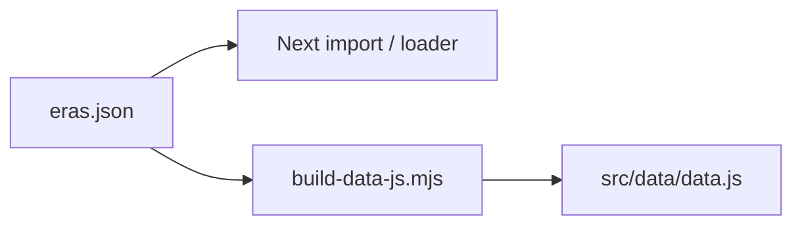

# Sprint: Visual-heavy era detail pages (Next + static parity)

## Context

- **Next.js** detail UI: [`src/app/detail/page.tsx`](c:\Users\drm23\personal\is 117\museum\src\app\detail\page.tsx) — currently shows hero + ~3 `objects` from [`src/data/movements.ts`](c:\Users\drm23\personal\is 117\museum\src\data\movements.ts).
- **Static** detail UI: [`detail.html`](c:\Users\drm23\personal\is 117\museum\detail.html) + [`src/js/detail.js`](c:\Users\drm23\personal\is 117\museum\src\js\detail.js) — reads `museumData` from [`src/data/data.js`](c:\Users\drm23\personal\is 117\museum\src\data\data.js).
- **Design alignment** (from [`agents.md`](c:\Users\drm23\personal\is 117\museum\agents.md) / [`agent.md`](c:\Users\drm23\personal\is 117\museum\agent.md)): Swiss minimal grid, high clarity, education-first copy; **glass** treatment consistent with existing liquid-glass patterns in root [`style.css`](c:\Users\drm23\personal\is 117\museum\style.css) (backdrop blur, thin borders, restrained type scale). **Policy**: every image needs **attribution + license/source** fields; uncertain facts flagged `requires-review` in content notes (not necessarily shown in UI).

## Clarifications captured from you

- **Surfaces**: implement **both** Next and static in parity.
- **Images**: **mixed** — Wikimedia Commons, museum IIIF/API URLs, and optional files under `public/` for edge cases.

## Data model (canonical source)

Introduce a **single canonical JSON** (e.g. [`content/eras.json`](c:\Users\drm23\personal\is 117\museum\content\eras.json) or [`src/data/eras.json`](c:\Users\drm23\personal\is 117\museum\src\data\eras.json)) shaped roughly as:

- **Era**: existing fields (slug, title, period, description, hero, mood, facts, etc.) **plus** `artworks: Artwork[]` (minimum **10** per era for launch target).
- **Artwork**: `title`, `artist`, `date`, `imageUrl`, `keyFeatures[]` (short phrases), `workBlurb`, `artistBlurb` **or** `artistId` referencing an `artists` map on the era to avoid repeating the same artist paragraph 10 times.
- **Attribution**: `creditLine`, `sourceUrl`, `license` (e.g. CC BY-SA / public domain), optional `requiresReview: boolean` on facts.

**Parity strategy (avoid double-editing):**

- Next: import JSON in TS (or generate `movements.ts` types from JSON via minimal loader).
- Static: add a small **`node scripts/build-data-js.mjs`** (or `npm run build:data`) that reads the same JSON and emits `src/data/data.js` as `const museumData = [...]`. Document in README; run after content changes.

## UX / layout (visual-heavy, minimal chrome)

**Shared intent**: images occupy **most of the viewport width**; text lives in **glass panels** (not heavy boxes), generous whitespace, strict typographic hierarchy.

Suggested structure (both surfaces):

1. **Hero**: full-bleed or near full-bleed era image + slim glass strip for title/period (reuse existing hero language).
2. **Gallery**: **10+** “feature frames” — large `aspect-ratio` image (e.g. 4/3 or 3/4), **overlay or adjacent** glass card with title, artist, date, 2–4 **key features** chips/lines, short work blurb.
3. **Artist context**: compact **artist blurb** (1–2 sentences) — show once per unique artist in-era, or repeat under each work if you prefer consistency over density (decide in pilot).
4. **Attribution row**: small meta line under each image (source + license), meets `agents.md` “trustworthy sources” expectation.
5. **Motion**: respect `prefers-reduced-motion`; lazy-load images (native `loading="lazy"` / IntersectionObserver on static if needed); no new animation libraries.

**Next.js implementation notes**: use `next/image` where domains are configured in `next.config` for remote patterns; fallback to `` only if remote hosts block optimization. Keep existing [`RevealSection`](c:\Users\drm23\personal\is 117\museum\src\components\reading\RevealSection.tsx) for section enters.

**Static implementation notes**: extend [`src/js/detail.js`](c:\Users\drm23\personal\is 117\museum\src\js\detail.js) template to render the new gallery; add CSS blocks to [`style.css`](c:\Users\drm23\personal\is 117\museum\style.css) (detail section) — **reuse variables** (`--glass-*`, radii, spacing) already defined for the glass recipe.

## Content workflow (sprint-sized)

- **Pilot**: fully populate **one** era end-to-end (recommend **Renaissance** or **Impressionism** — rich Commons coverage) with 10–12 artworks, mixed URLs, complete attributions.
- **Rollout**: replicate pattern for remaining eras; accept slightly uneven counts if sourcing is hard, but never below 10 without explicit `requiresReview` flag in JSON.

## Exit criteria

- Both `/detail?era=…` (Next) and `detail.html?era=…` (static) render the **same** artworks for the same slug (verified on 2–3 slugs).
- Each era in scope has **≥10** artworks with image + metadata + attribution.
- Lighthouse sanity: no massive layout shift (reserve image aspect ratio); keyboard-scroll still usable.
- No new frameworks; Lenis on static unchanged unless it conflicts with taller pages (then only fix regressions).

## Risks / decisions to lock in sprint kickoff

- **Remote images in Next** require `images.remotePatterns` updates when adding IIIF/museum hosts.
- **Legal/licensing**: mixed sources mean every row must have a **license** field; avoid hotlinking fragile URLs without fallback.
- **Typography**: [`agent.md`](c:\Users\drm23\personal\is 117\museum\agent.md) mentions serif display; current Next detail is sans. Optional sub-task: **display serif for H1/H2 only** if it does not clash with your dark-glass aesthetic—treat as polish after layout ships.
