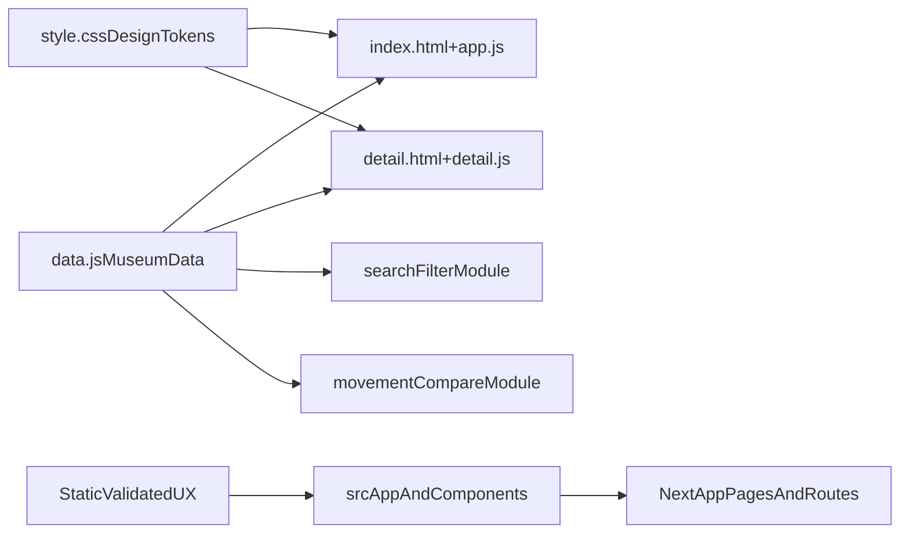

# Museum Website Implementation Plan

## Goal
Launch a high-polish first release that keeps all current eras while shifting the visual language to cinematic Swiss minimalism (single sans type, full-bleed imagery, restrained glass surfaces) and adding high-value museum interactions.

## Phase 1 - Static Foundation (Primary)

### 1) Design System Consolidation in Existing Static App
- Use the current static app as the canonical build target: [c:\Users\drm23\personal\is 117\museum\index.html](c:\Users\drm23\personal\is 117\museum\index.html), [c:\Users\drm23\personal\is 117\museum\style.css](c:\Users\drm23\personal\is 117\museum\style.css), [c:\Users\drm23\personal\is 117\museum\app.js](c:\Users\drm23\personal\is 117\museum\app.js).
- Normalize visual tokens in `:root` (spacing scale, blur levels, border opacity, shadow strength, motion duration/easing) to enforce Swiss consistency.
- Replace mixed spacing values with one rhythm (8pt-based scale) and align section/card layout to a consistent grid.

### 2) Cinematic Hero + Full-Bleed Era Experience
- Upgrade era sections in [c:\Users\drm23\personal\is 117\museum\index.html](c:\Users\drm23\personal\is 117\museum\index.html) to prioritize artwork-first storytelling.
- Refine glass overlays in [c:\Users\drm23\personal\is 117\museum\style.css](c:\Users\drm23\personal\is 117\museum\style.css): subtler chrome, cleaner edge highlights, less layered noise.
- Implement high-motion but controlled transitions in [c:\Users\drm23\personal\is 117\museum\app.js](c:\Users\drm23\personal\is 117\museum\app.js) (scene transitions, staggered text reveals, smoother anchor jumps).

### 3) Typography and Editorial Hierarchy
- Adopt one modern sans stack globally in [c:\Users\drm23\personal\is 117\museum\style.css](c:\Users\drm23\personal\is 117\museum\style.css) with clear scale for display/title/body/meta.
- Tighten line lengths and typographic contrast for cinematic readability over images.
- Reduce competing text styles to preserve minimal Swiss editorial discipline.

### 4) Feature Additions (Launch Priorities)
- Add `search/filter` across eras in [c:\Users\drm23\personal\is 117\museum\app.js](c:\Users\drm23\personal\is 117\museum\app.js) and markup in [c:\Users\drm23\personal\is 117\museum\index.html](c:\Users\drm23\personal\is 117\museum\index.html).
- Expand curated object detail pages using [c:\Users\drm23\personal\is 117\museum\detail.html](c:\Users\drm23\personal\is 117\museum\detail.html) and [c:\Users\drm23\personal\is 117\museum\detail.js](c:\Users\drm23\personal\is 117\museum\detail.js): artist/date/medium/context/story blocks.
- Add a movement comparison module (A/B compare panel) on home or detail views using data in [c:\Users\drm23\personal\is 117\museum\data.js](c:\Users\drm23\personal\is 117\museum\data.js).

### 5) Content and Data Shape Improvements
- Extend era objects in [c:\Users\drm23\personal\is 117\museum\data.js](c:\Users\drm23\personal\is 117\museum\data.js) with fields needed by new UX (hero subtitle, key objects, compare tags, filter facets).
- Keep all current eras live, but standardize field completeness and tone.
- Add content guardrails from [c:\Users\drm23\personal\is 117\museum\AGENTS.md](c:\Users\drm23\personal\is 117\museum\AGENTS.md) (learning-friendly context and movement relationships).

### 6) Accessibility and Performance Pass
- Add contrast-safe text scrims for full-bleed imagery in [c:\Users\drm23\personal\is 117\museum\style.css](c:\Users\drm23\personal\is 117\museum\style.css).
- Implement `prefers-reduced-motion` fallbacks for cinematic transitions.
- Audit image loading strategy (defer/non-blocking, quality presets) to keep first load responsive.

## Phase 2 - Port to Next.js/TypeScript (Secondary)

### 7) Mirror Validated Static UX Into `src/`
- Port approved data model from [c:\Users\drm23\personal\is 117\museum\data.js](c:\Users\drm23\personal\is 117\museum\data.js) into [c:\Users\drm23\personal\is 117\museum\src\data\movements.ts](c:\Users\drm23\personal\is 117\museum\src\data\movements.ts).
- Recreate validated card/section patterns in [c:\Users\drm23\personal\is 117\museum\src\components\MovementCard.tsx](c:\Users\drm23\personal\is 117\museum\src\components\MovementCard.tsx) and [c:\Users\drm23\personal\is 117\museum\src\app\page.tsx](c:\Users\drm23\personal\is 117\museum\src\app\page.tsx).
- Preserve typography, spacing, and motion token parity with static version.

### 8) Prepare Production-Ready App Surface
- Add robust routing for detail pages and comparison pages in `src/app`.
- Replace placeholder links/content with actual movement/object entries.
- Ensure search/filter and compare interactions are typed and componentized.

## Delivery Sequence
1. Visual token cleanup + typography in static CSS.
2. Cinematic section and motion upgrade.
3. Search/filter implementation.
4. Curated object detail structure.
5. Movement comparison module.
6. Accessibility/performance hardening.
7. Port stabilized UX/data into Next.js.

## Architecture View (Target)

## Acceptance Criteria
- Visual language matches cinematic Swiss minimalism with restrained glass overlays.
- All current eras remain available and consistently structured.
- Search/filter, curated object details, and movement compare are functional.
- Motion remains immersive but has reduced-motion fallback.
- Static implementation is stable enough to serve as source-of-truth for Next.js port.